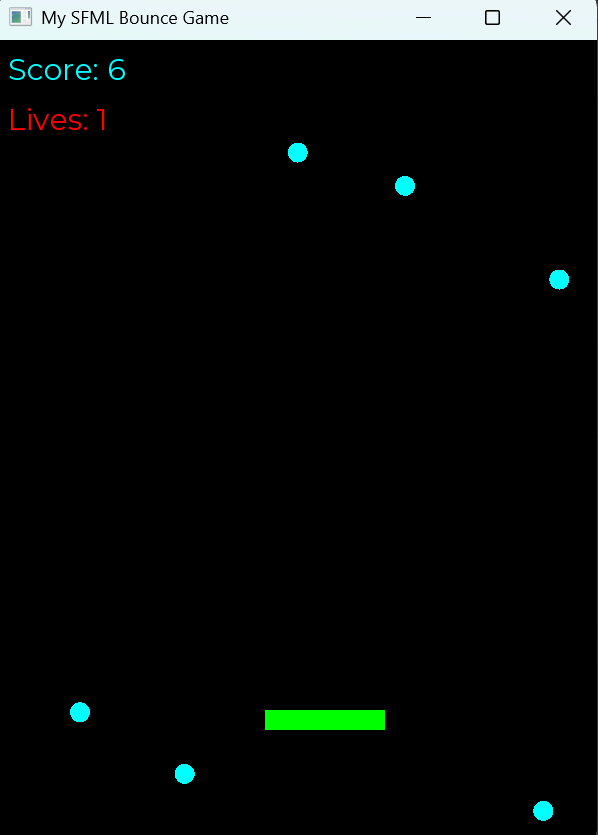

# Bounce Game (SFML 3 + C++20)



A simple **Bounce** game built with **C++20** and **SFML 3** as a learning project to practice modern C++ game development concepts and become familiar with the SFML 3 API.

This project focuses on writing clean, maintainable code while exploring game programming fundamentals such as rendering, input handling, collision detection, game loops, and object-oriented design.

---

## About the Game

Bounce is a classic arcade-style game where the player controls a paddle to keep a ball bouncing around the screen.

The objective is simple:

- Keep the ball from falling below the paddle.
- Bounce the ball back into play.
- Try to survive as long as possible.
- (Optional) Destroy blocks or collect points if those features are added later.

This project is intentionally kept simple so the focus remains on learning game development rather than building a feature-heavy game.

---

## Features

- Built with **C++20**
- Uses **SFML 3**
- Smooth real-time rendering
- Keyboard input handling
- Ball physics and collision detection
- Paddle movement
- Simple game loop architecture
- Easy to extend with new gameplay features

---

## Controls

| Key | Action |
|------|--------|
| Left Arrow / A | Move paddle left |
| Right Arrow / D | Move paddle right |
| Esc | Quit the game |

---

## Building

### Requirements

- C++20 compatible compiler
- CMake 3.20+
- SFML 3

### Clone the repository

```bash
git clone https://github.com/yourusername/bounceGame.git
cd bounceGame
```

### Configure

```bash
cmake -B Build -D CMAKE_BUILD_TYPE=Debug
```

### Build

```bash
cmake --build Build --config Debug -j
```

### Run

```bash
./build/Debug/BounceGame
```


### Release Configure

```bash
cmake -S . -B build    
```

### Release Build

```bash
cmake --build build --config Release
```

### Run

```bash
./build/Release/BounceGame
```
*(Executable name may vary depending on your platform and CMake configuration.)*

---

## Learning Goals

This project is mainly intended to practice:

- Modern C++20 features
- SFML 3 API
- Game loop architecture
- Object-oriented programming
- Collision detection
- Real-time input processing
- Basic game physics
- Resource management
- Clean project structure

---

## Project Structure

```
.
├── Content/        # Fonts, textures, sounds
├── Include/        # Header files
├── Source/         # Source files
├── CMakeLists.txt
└── README.md
```

---

## Future Improvements

Some ideas for expanding the project:

- Score system
- Multiple levels
- Brick breaking mechanics
- Sound effects
- Background music
- Particle effects
- Power-ups
- Pause menu
- Game over screen
- High score saving
- Controller support

---

## License

This project is provided for educational purposes and is free to modify and experiment with.

---

## Acknowledgements

- **SFML** for providing a simple and powerful multimedia library.
- The C++ community for countless learning resources and best practices.

---
